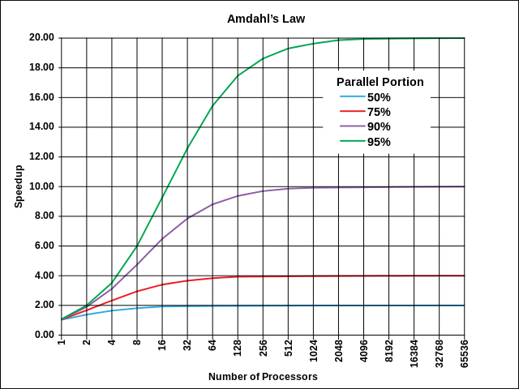

Zusammenfassung _I W909 High Performance Computing_ WS 14/15
============================================================

# 1 Introduction

## Literatur

* [Parallele Programmierung](http://link.springer.com/book/10.1007%2F978-3-642-13604-7)
* [The OpenCL Programming Book](http://www.fixstars.com/en/opencl/book/)

## Wichtige Kennzahlen

### Speedup

* Maß für relativen Geschwindigkeitsgewinn
* Verhältnis zwischen sequentieller und paralleler Ausführungszeit

| Variable | Bedeutung |
| ----- | ----- |
| $t_{S}$ | Sequentielle Laufzeit |
| $t_{P}$ | Parallele Laufzeit |
| $S$  | Speedup |

$S = \frac{t_{S}}{t_{P}}$

Beispiel für Speedup

$t_{S} = 60$ Sekunden

$t_{P} = 30$ Sekunden

$S = \frac{60}{30} = 2$

* Idealer Speedup ist gleich Anzahl der Prozessoren
* Programme sind in der Regel nicht voll parallelisierbar (aufgrund von Datenabhängigkeiten)
* Möglich: Superlinearer Speedup (mehr als Anzahl Prozessoren) durch Cache-Effekte


### Effizienz

| Variable | Bedeutung |
| ----- | ----- |
|$E$ | Effizienz |
|$P$ | Anzahl Prozessoren (optimaler Speedup) |

$E = \frac{S}{P}$

Beispiel für Effizienz

$S = 10$

$P = 16$

$E = \frac{10}{16} = 0.625$

* Ideale Effizienz: 1
* Wertebereich $E \in {[0,1]}$

### Amdahl

| Variable | Bedeutung |
| ----- | ----- |
|$t_{S}$ | Anteil der sequentiell ausgeführt wird |
|$t_{P}$ | Anteil der parallel ausgeführt wird |
|$P$ | Anzahl Prozessoren (optimaler Speedup) |

$S = \frac{1}{t_{S} + \frac{t_{P}}{P}} = \frac{1}{(1 - t_{P}) + \frac{t_{P}}{P}}$

* Pessimistische Abschätzung. Aussage: Parallelisierung bringt keinen wesentlichen Speedup und ist nicht effizient.
* Größtmögliche Beschleunigung ist linear
* Problemgröße spielt keine Rolle



Beispiel für Amdahl mit 5% parallelem Anteil und steigener Anzahl an CPUs.

$S$      | $t_{S}$| $t_{P}$| $P$
---------|--------|--------|------
1,00     |  0,05  |  0,95  |  1
1,90     |        |        |  2
3,48     |        |        |  4
5,93     |        |        |  8
9,14     |        |        |  16  
12,55    |        |        |  32  
15,42    |        |        |  64  
17,41    |        |        |  128
18,66    |        |        |  265
19,28    |        |        |  512
19,64    |        |        |  1024

### Gustafson

$S = t_{S} + P * t_{P}$

* [Paper von Gustafson](http://www.johngustafson.net/pubs/pub13/amdahl.htm)
* Bezieht Problemgröße mit ein
* Aussage: Parallelisierung kann jeden Speedup und einen hohen Grad an Effizienz erreichen wenn das Problem groß genug ist und genug CPU genutzt wird.

Gleiches Beispiel wie bei Amdahl

$S$      | $t_{S}$| $t_{P}$| $P$
---------|--------|--------|------
1,00     |  0,05  |  0,95  |  1
1,95     |        |        |  2
3,85     |        |        |  4
7,65     |        |        |  8
15,25    |        |        |  16  
30,45    |        |        |  32  
60,85    |        |        |  64  
121,65   |        |        |  128
251,80   |        |        |  265
486,45   |        |        |  512
972,85   |        |        |  1024

### FLOPS

* Floating Point Operations Per Second
* Anzahl der Gleitkommaoperationen (Addition, Subtraktion und/oder Multiplikation, Division) pro Sekunde


### FLOPS pro Watt

* Maß für Energieeffizienz
* Proportional zu Kosten (Strom)

## Speichermodelle

### Shared Memory

* Ein globaler Adressraum auf den alle Prozessoren zugreifen
* Änderungen im Speicher sind für alle Prozessoren sichtbar (uu. nicht sofort)


### Distributed Memory

* Zugriff auf Speicher von anderem Prozessor erfolgt über Netzwerk
* Jeder Prozessor hat eigenen Speicher
* Änderungen eines Prozessors sind nicht für andere sichtbar


### Vor- und Nachteile

| Shared Memory | Distributed Memory |
| ------------- | ------------------ |
| + Einfacher Datenaustausch | - Schwerer Datenaustausch (manueller Aufwand) |
| - Schwerer Datenzugriff (manueller Aufwand) | + Einfacher Datenzugriff |
| + Schnelle und einfache parallelisierung | - Kommunikation muss entworfen werden |
| - Beschränkte Skalierbarkeit | + (uU.) gute Skalierbarkeit |

### Hybride Programmierung

* Mischung aus Shared und Distributed
* Manueller Aufwand für Datenaustauch und Datenzugriff
* Kommunikation notwendig
* Dafür: Gute Skalierbarkeit


# 2 openMP

[openmp.org](http://www.openmp.org)

* Code läuft per Default sequentiell, wird nur bei Bedarf parallelisiert
* Steuerung über Compilerdirektiven (#pragma)
* Variablen können shared und private sein

```{breaklines=true .c}
int s = 0;
int p;
#pragma omp parallel shared(s) private(p)
{
  p = 0;
  s++;
  p++;
  printf("s = %d\n", s);
  printf("p = %d\n", p);
}
```
> s ist am Ende 4, p ist 1

```{breaklines=true .c}
int num_threads;
int id;

#pragma omp parallel private(id, num_threads)
{
  num_threads = omp_get_num_threads();
  id = omp_get_thread_num();
  printf("Hello, my Id is: %d %d \n", id, num_threads);
}
```

## barrier

Erst wenn alle Threads diese Stelle erreicht haben dürfen sie weiter machen.

## critical

Nur ein Thread darf diesen Code ausführen.

## atomic

Der Code wird atomar (ohne Unterbrechung) ausgeführt.

# 3 MPI

[MPI Funktionen](http://mpi.deino.net/mpi_functions/)

## MPI API Summary

### MPI_Init

```{breaklines=true .c}
int MPI_Init(int *argc, char ***argv);
```

### MPI_Send

```{breaklines=true .c}
int MPI_Send(void *buffer, int count, MPI_Datatype datatype, int destination, int tag, MPI_Comm communicator);
```
#### Out Parameters
* none

### MPI_Recv

```{breaklines=true .c}
int MPI_Recv(void *buffer, int count, MPI_Datatype datatype, int source, int tag, MPI_Comm communicator, MPI_Status status);
```
#### Out Parameters
* `buffer`
* `status`

### MPI_Reduce

```{breaklines=true .c}
int MPI_Reduce(void *sendbuffer, void *recievebuffer, int count, MPI_Datatype datatype, MPI_Op operation, int rootprocess, MPI_Comm communicator);
```
#### Out Parameters
* `recievebuffer`


```{breaklines=true .c}

```

```{breaklines=true .c}

```


# 4 CPU


# 5 Performance

## Performance Modellierung

### Timing Modell von Van de Velde

Buch von van de Velde [Concurrent Scientific Computing](http://www.springer.com/mathematics/analysis/book/978-0-387-94195-0) (Leider nicht über SpringerLink erhältlich)


# 6 Errors


# 7 Networks


# 8 GPU / OpenCl


# 9 Patterns
